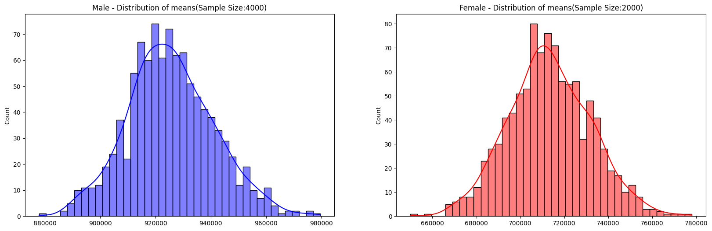

# Walmart Customer Insights

This repository contains data analysis and visualization of a Walmart dataset using Python and Jupyter Notebook. The goal is to extract meaningful insights from sales data, perform exploratory data analysis (EDA), and create visualizations for better decision-making.

## Features

- **Data Analysis**: Analyze Walmart sales data to uncover trends and patterns.
- **Exploratory Data Analysis (EDA)**: Perform detailed exploration of the dataset.
- **Visualization**: Create insightful visualizations to support data-driven decisions.

## Screenshots

Here are some screenshots showcasing the analysis and visualizations:





## Getting Started

Follow these instructions to set up the project on your local machine.

### Prerequisites

Ensure you have the following installed:
- Python 3.8 or above
- Jupyter Notebook

### Installation

1. Clone the repository:
   ```bash
   git clone https://github.com/arcvrsh/Walmart-Customer-Insights.git
   ```
2. Navigate to the project directory:
   ```bash
   cd Walmart-Customer-Insights
   ```
3. Install the required dependencies:
   ```bash
   pip install -r requirements.txt
   ```

### Usage

1. Start Jupyter Notebook:
   ```bash
   jupyter notebook
   ```
2. Open the relevant `.ipynb` files to explore the analysis and visualizations.

## Contributing

Contributions are welcome! Feel free to submit a pull request or open an issue.

## License

This project is licensed under the MIT License. See the `LICENSE` file for details.

## Acknowledgments

- Walmart for the dataset
- Open-source libraries and tools used in the project
